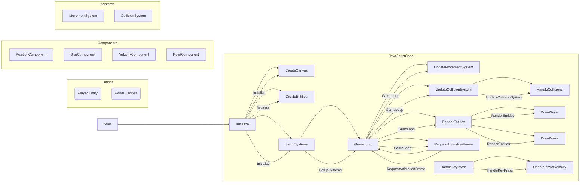

```mermaid
graph LR
    Start --> Initialize
    Initialize --> CreateCanvas
    Initialize --> CreateEntities
    Initialize --> SetupSystems
    SetupSystems --> GameLoop
    GameLoop --> UpdateMovementSystem
    GameLoop --> UpdateCollisionSystem
    UpdateCollisionSystem --> HandleCollisions
    GameLoop --> RenderEntities
    RenderEntities --> DrawPlayer
    RenderEntities --> DrawPoints
    GameLoop --> RequestAnimationFrame
    RequestAnimationFrame --> GameLoop
    HandleKeyPress --> UpdatePlayerVelocity

    subgraph JavaScriptCode
        Initialize --> |Initialize| CreateCanvas
        Initialize --> |Initialize| CreateEntities
        Initialize --> |Initialize| SetupSystems
        SetupSystems --> |SetupSystems| GameLoop
        GameLoop --> |GameLoop| UpdateMovementSystem
        GameLoop --> |GameLoop| UpdateCollisionSystem
        UpdateCollisionSystem --> |UpdateCollisionSystem| HandleCollisions
        GameLoop --> |GameLoop| RenderEntities
        RenderEntities --> |RenderEntities| DrawPlayer
        RenderEntities --> |RenderEntities| DrawPoints
        GameLoop --> |GameLoop| RequestAnimationFrame
        RequestAnimationFrame --> |RequestAnimationFrame| GameLoop
        HandleKeyPress --> |HandleKeyPress| UpdatePlayerVelocity
    end

    subgraph Entities
        player(Player Entity)
        points(Points Entities)
    end

    subgraph Components
        PositionComponent
        SizeComponent
        VelocityComponent
        PointComponent
    end

    subgraph Systems
        MovementSystem
        CollisionSystem
    end

```